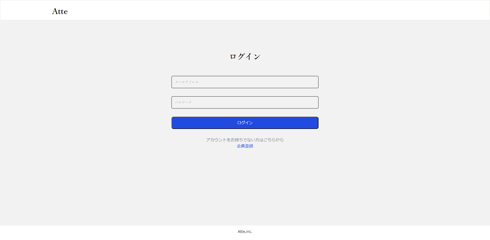
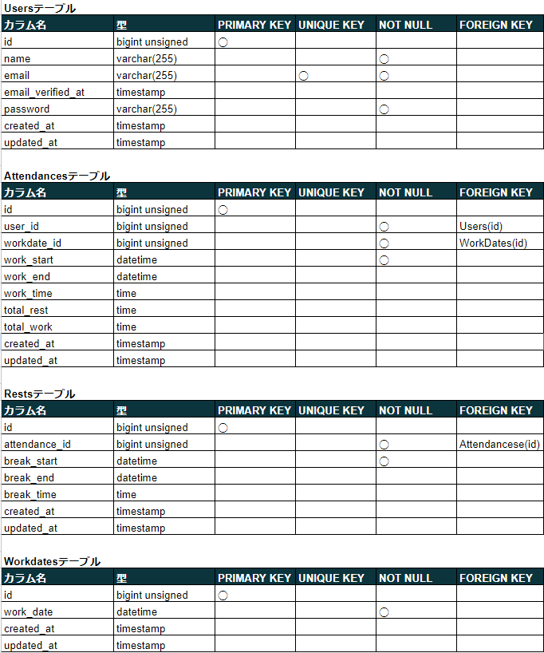
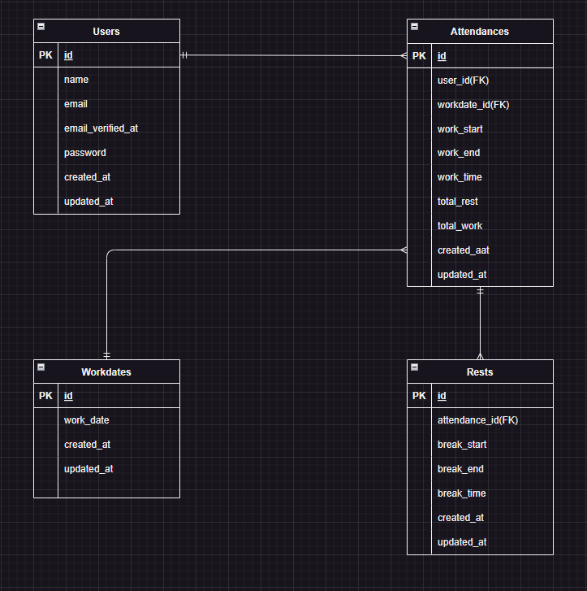

# アプリケーション名

- Atte（アット）
- 勤怠管理システムのアプリ
- 

# 作成した目的

- 社内人事評価のため

# 機能一覧

- 会員登録
- メールによる 2 要素認証
- ログイン
- ログアウト
- 勤務開始(日を跨いだ時点で翌日の出勤操作に切り替わる)
- 勤務終了
- 休憩開始(1 日で何度も休憩が可能)
- 休憩終了
- 日付別勤怠実績表示(日付検索による勤怠実績表示も可能)
- ユーザー一覧表示(ユーザー検索も可能)
- ユーザー別の月次勤怠実績表示(月検索による勤怠実績表示も可能)
- ページネーション(5 件ずつ)

# 使用技術(実行環境)

- PHP 7.4.9
- Laravel 8.83.27
- MySQL 8.0.26
- nginx 1.21.1

# テーブル設計



# ER 図



# 環境構築

**Docker ビルド**

1. `git clone git@github.com:ueppa0716/basic-test.git`
2. DockerDesktop アプリを立ち上げる
3. `docker-compose up -d --build`

**Laravel 環境構築**

1. `docker-compose exec php bash`
2. `composer install`
3. 「.env.example」ファイルを 「.env」ファイルに命名を変更。または、新しく.env ファイルを作成
4. .env に以下の環境変数を追加

```text
DB_CONNECTION=mysql
DB_HOST=mysql
DB_PORT=3306
DB_DATABASE=laravel_db
DB_USERNAME=laravel_user
DB_PASSWORD=laravel_pass
```

5. アプリケーションキーの作成

```bash
php artisan key:generate
```

6. マイグレーションの実行

```bash
php artisan migrate
```
